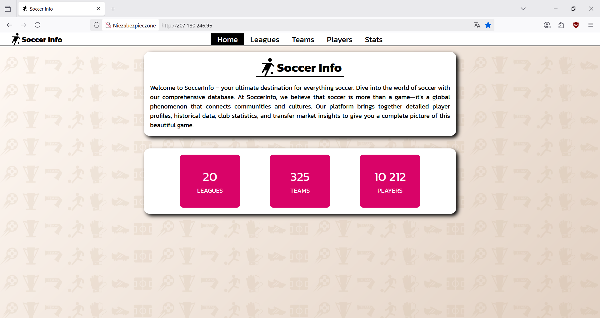
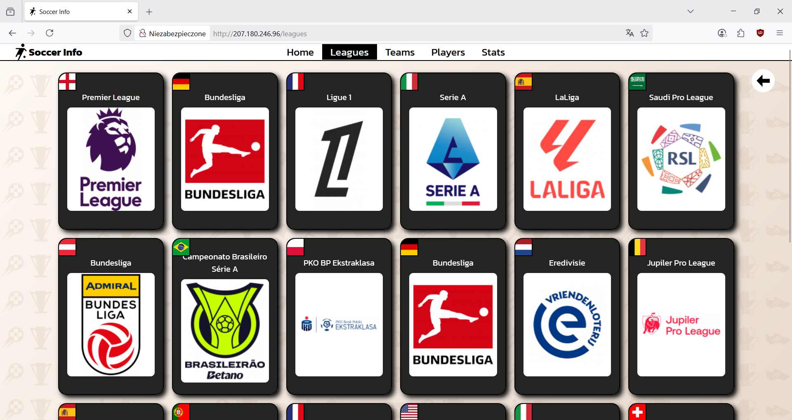
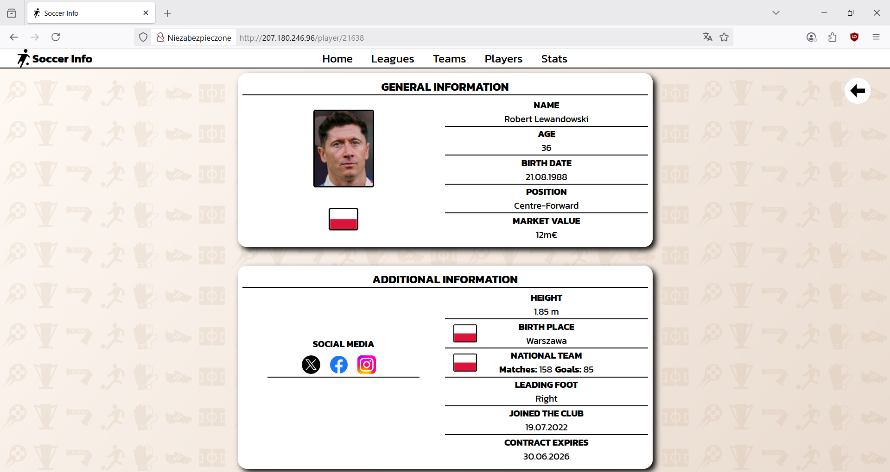
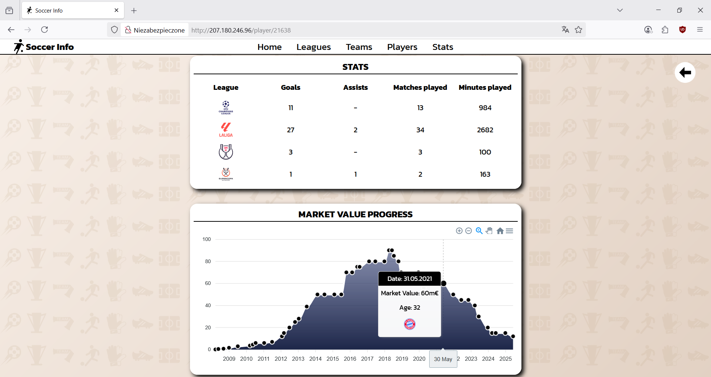
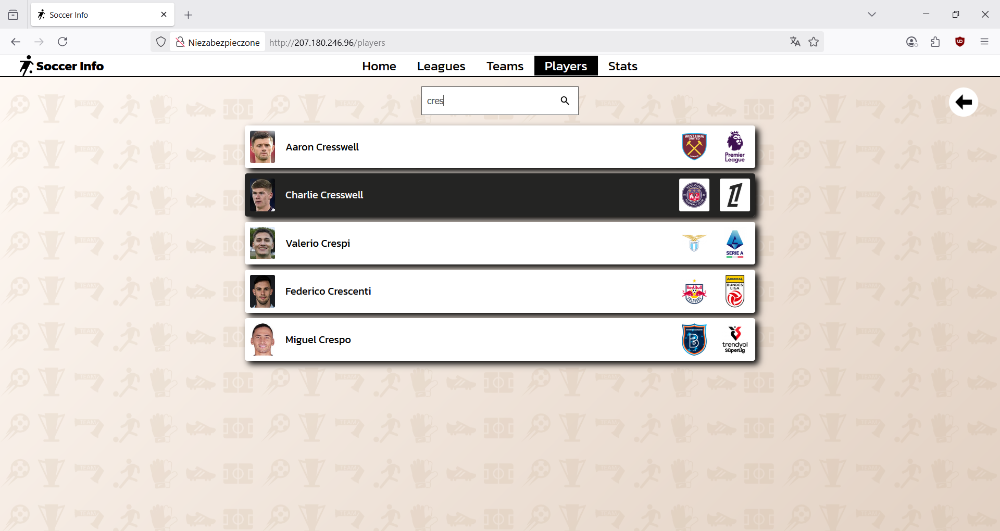
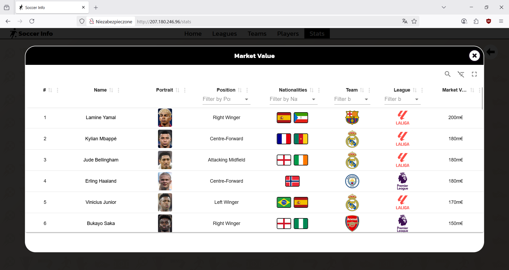

# SoccerInfo

## Table of contents

- [Website URL](#website-url)
- [General info](#general-info)
- [Technologies](#technologies)
- [Screenshots](#screenshots)

## Website URL

http://207.180.246.96/

## General info

A web scraper application designed to extract football-related data from external websites. The application fetches structured information such as leagues, teams, players, and transfers, and stores it in a local database.

The solution is built using the Clean Architecture approach, which separates concerns into distinct layers (Presentation, Application, Domain, Persistence, Infrastructure). It also adopts the CQRS pattern.

Data is displayed in a React frontend app, allowing users to browse up-to-date football information.

## Technologies

- ASP.NET 8
- React
- MediatR
- Playwright
- MS SQL
- Entity Framework 
- CI/CD (Github Actions)

## Screenshots

